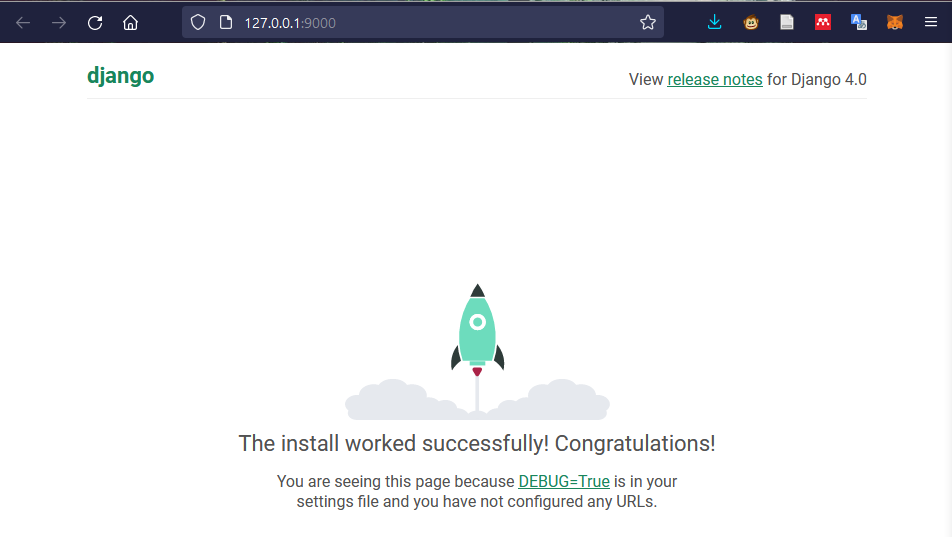

# django_Payment_Service
Django-based Payment Service v1.0


# intallation steps:
```
pip 3 install pipenv
pipenv install django
```

# Launching the subshell in virtual environment
```
pipenv shell
```

# Start Django-admin 
With a suffix ".", we are telling django to use the current projectname as current main directory
```
django-admin startproject paymentservice .
```
# Django-Skeleton
Please refer to the following link: >> https://django-project-skeleton.readthedocs.io/en/latest/structure.html

# Configuring Django's settings
without having runserver error for django, we use the following command on teh manage.py which is the app WRAPPER with a custom port number e.g. 9000
```
python manage.py runserver 9000
```
<a href="#" target="_blank" rel="noreferrer"></a>

# installing Python interpreter
1. (Ctrl+Shift+P) on VSCode 
2. get the actual environment URL
```
pipenv --venv
```

copy the path 
e.g. "C:\Users\rmastour\.virtualenvs\django_Payment_Service-hKmBDVso"

3. install interpreter path (Ctrl+Shift+P) and type 
```
>python: select Interpeter
```
> by pasting the latter path 
"C:\Users\rmastour\.virtualenvs\django_Payment_Service-hKmBDVso\bin\python"